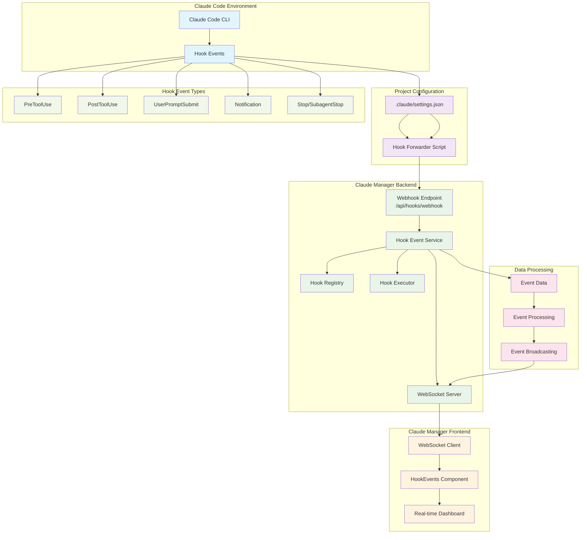
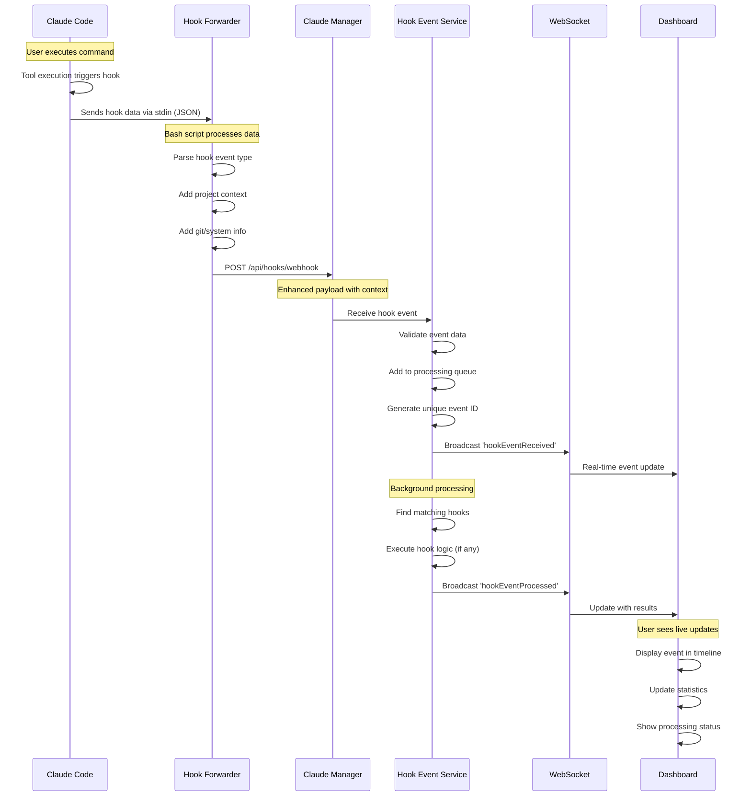

# Claude Code Hook System Architecture

This document explains how the Claude Manager hook event system works, providing a JavaScript-based alternative to complex bash scripts for processing Claude Code hook events.

## System Overview

The hook system captures events from Claude Code, forwards them to Claude Manager for processing, and displays them in real-time on the dashboard.

## Architecture Diagram



## Detailed Flow Diagram



## Component Details

### 1. Claude Code Integration

Claude Code triggers hooks at specific events:
- **PreToolUse**: Before any tool is executed
- **PostToolUse**: After tool completes successfully
- **UserPromptSubmit**: When user submits a prompt
- **Notification**: On system notifications
- **Stop/SubagentStop**: When Claude finishes responding

### 2. Hook Forwarder Scripts

**Basic Forwarder** (`claude-hook-forwarder.sh`):
```bash
# Reads Claude hook data from stdin
HOOK_DATA=$(cat)
# Forwards to Claude Manager
curl -X POST -d "$PAYLOAD" http://localhost:3455/api/hooks/webhook
```

**Advanced Forwarder** (`claude-hook-forwarder-advanced.sh`):
- Extracts tool names using `jq`
- Adds git branch/commit info
- Includes system context (user, hostname)
- Supports debug logging
- Handles timeouts and error reporting

### 3. Backend Processing

**Hook Event Service** manages the complete lifecycle:
- **Event Reception**: Validates and queues incoming events
- **Processing Queue**: Handles events asynchronously
- **Hook Matching**: Finds configured hooks for events
- **Execution**: Runs JavaScript-based hook logic
- **Broadcasting**: Sends updates via WebSocket

**Data Structure**:
```json
{
  "originalHookData": {
    "session_id": "abc123",
    "transcript_path": "/path/to/conversation.jsonl",
    "hook_event_name": "PreToolUse",
    "tool_name": "Write",
    "tool_input": {...}
  },
  "eventType": "PreToolUse",
  "toolName": "Write",
  "projectPath": "/project/path",
  "timestamp": 1635724800000,
  "context": {
    "user": "daniel",
    "git": { "branch": "main", "commit": "abc123" }
  }
}
```

### 4. Frontend Dashboard

**HookEvents Component** provides:
- **Real-time Display**: Live event timeline
- **Connection Status**: WebSocket connection indicator
- **Event Filtering**: By type, project, tool
- **Detailed Inspection**: Modal with full event data
- **Statistics**: Events received, processed, errors
- **Event History**: Configurable limit (25-100 events)

## Setup Process

### Automatic Setup
```bash
# From any Claude Code project
/path/to/claude-manager/bin/setup-hook-forwarding
```

This script:
1. Detects current project directory
2. Checks if Claude Manager is running
3. Creates hook configuration
4. Merges with existing settings
5. Provides usage instructions

### Manual Configuration

Add to `.claude/settings.json`:
```json
{
  "hooks": {
    "PreToolUse": [
      {
        "matcher": ".*",
        "hooks": [
          {
            "type": "command",
            "command": "CLAUDE_HOOK_EVENT=PreToolUse /path/to/forwarder.sh"
          }
        ]
      }
    ]
  }
}
```

## Benefits

### 🚀 **JavaScript vs Bash**
- **Complex Logic**: Easier to write sophisticated processing
- **Error Handling**: Better exception handling and logging
- **Async Operations**: Non-blocking event processing
- **Data Structures**: Rich object manipulation
- **Testing**: Unit testable hook logic

### 📊 **Real-time Monitoring**
- **Live Dashboard**: See all hook events as they happen
- **Project Awareness**: Track events across multiple projects
- **Performance Metrics**: Processing times and success rates
- **Debugging**: Full event data inspection

### 🔧 **Centralized Management**
- **Single Point**: Manage all project hooks from one place
- **Configuration**: Global and project-specific settings
- **History**: Event timeline and analytics
- **Integration**: Works with existing Claude Code workflows

## Usage Examples

### Debug Tool Usage
Monitor when specific tools are used:
```javascript
// In Hook Event Service
if (event.toolName === 'Bash' && event.context.dangerous) {
  // Send notification or block execution
  await sendSlackAlert(`Dangerous bash command detected in ${event.projectName}`);
}
```

### Auto-formatting
Trigger formatters after file changes:
```javascript
if (event.eventType === 'PostToolUse' && event.toolName === 'Write') {
  const filePath = event.originalHookData.tool_input.file_path;
  if (filePath.endsWith('.js')) {
    await exec(`prettier --write ${filePath}`);
  }
}
```

### Project Analytics
Track development patterns:
```javascript
// Count tool usage by project
const stats = await analyzeToolUsage(event.projectName);
await updateProjectDashboard(stats);
```

This hook system provides a powerful foundation for extending Claude Code with custom behaviors while maintaining visibility and control through the centralized dashboard.